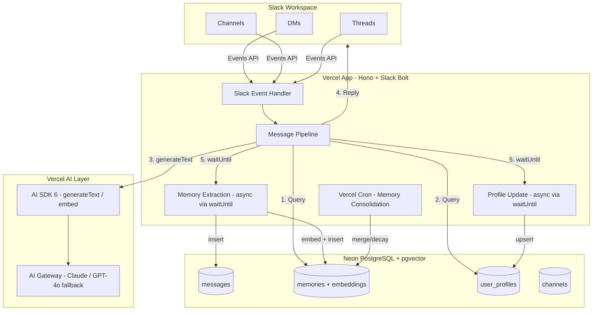

# Aura v0 Implementation Plan

## Architecture



## Stack

- **Runtime**: Node.js on Vercel (serverless functions)
- **Framework**: [Hono](https://hono.dev) (lightweight, Vercel-native web framework)
- **Slack**: `@slack/bolt` + `@vercel/slack-bolt` (official Vercel adapter)
- **LLM**: Vercel AI SDK 6 (`ai` package) + Vercel AI Gateway
- **Database**: Neon PostgreSQL with `pgvector` extension
- **ORM**: Drizzle ORM with `drizzle-orm/neon-serverless`
- **Embeddings**: Vercel AI SDK `embed()` / `embedMany()` via `openai/text-embedding-3-small`
- **Deployment**: Vercel (serverless functions + Vercel Cron)

## Project Structure

```
aura/
  src/
    app.ts                  # Hono app + Slack Bolt setup, POST /slack/events
    slack/
      handler.ts            # Route Slack events to the pipeline
      formatter.ts          # Convert LLM output to Slack mrkdwn
    pipeline/
      index.ts              # Main message pipeline orchestrator
      context.ts            # Build context: identify user, channel, thread
      prompt.ts             # Assemble system prompt (personality + memories + user profile)
      respond.ts            # Call LLM via AI SDK, return response
    memory/
      store.ts              # Insert/query memories in Neon
      extract.ts            # LLM-based memory extraction from conversations
      retrieve.ts           # Semantic search: embed query -> pgvector similarity
      consolidate.ts        # Merge duplicates, decay old memories (cron job)
    personality/
      system-prompt.ts      # Aura's base personality prompt (version-controlled)
      anti-patterns.ts      # Post-processing: strip sycophancy, hedge words, etc.
    users/
      profiles.ts           # User profile CRUD and auto-update logic
    db/
      schema.ts             # Drizzle schema (all tables)
      client.ts             # Neon + Drizzle client setup
      migrations/           # Drizzle migration files
    lib/
      ai.ts                 # Vercel AI SDK + Gateway client setup
      embeddings.ts         # Embedding helper (wraps AI SDK embed)
      privacy.ts            # DM privacy rules (FR-2.4)
      temporal.ts           # Time/date helpers, relative time formatting
      logger.ts             # Structured logging
    cron/
      consolidate.ts        # Vercel Cron handler for memory consolidation
  drizzle.config.ts         # Drizzle Kit config
  vercel.json               # Vercel config (cron schedules, routes)
  package.json
  tsconfig.json
  .env.example
```

## Database Schema (Neon + Drizzle)

Four core tables, all in one Neon database:

`**messages**` -- raw conversation log (FR-2.1)

- `id` (uuid, PK)
- `slack_ts` (text, unique) -- Slack message timestamp ID
- `slack_thread_ts` (text, nullable) -- parent thread timestamp
- `channel_id` (text) -- Slack channel/DM ID
- `channel_type` (enum: "dm", "public_channel", "private_channel")
- `user_id` (text) -- Slack user ID
- `role` (enum: "user", "assistant")
- `content` (text)
- `created_at` (timestamptz)

`**memories**` -- extracted structured facts (FR-2.2)

- `id` (uuid, PK)
- `content` (text) -- the memory itself, e.g. "Joan prefers bullet points"
- `type` (enum: "fact", "decision", "personal", "relationship", "sentiment", "open_thread")
- `source_message_id` (uuid, FK -> messages) -- where this was extracted from
- `source_channel_type` (enum) -- inherited from source message, for privacy rules
- `related_user_ids` (text[]) -- Slack user IDs this memory is about
- `embedding` (vector(1536)) -- for semantic search via pgvector
- `relevance_score` (float, default 1.0) -- decays over time
- `created_at` (timestamptz)
- `updated_at` (timestamptz)

`**user_profiles**` -- auto-generated profiles (FR-4.1)

- `id` (uuid, PK)
- `slack_user_id` (text, unique)
- `display_name` (text)
- `timezone` (text, nullable) -- from Slack profile
- `communication_style` (jsonb) -- { verbosity, formality, emoji_usage, preferred_format }
- `known_facts` (jsonb) -- personal details, role, topics of interest
- `interaction_count` (integer)
- `last_interaction_at` (timestamptz)
- `created_at` (timestamptz)
- `updated_at` (timestamptz)

`**channels**` -- channel metadata cache

- `id` (uuid, PK)
- `slack_channel_id` (text, unique)
- `name` (text)
- `type` (enum: "dm", "public_channel", "private_channel")
- `topic` (text, nullable)
- `updated_at` (timestamptz)

Indexes:

- `memories.embedding` -- HNSW index for fast approximate nearest neighbor search
- `memories.related_user_ids` -- GIN index for user-based filtering
- `messages.channel_id + created_at` -- for thread context retrieval
- `messages.slack_ts` -- unique, for deduplication

## Core Implementation Details

### 1. Slack Event Handler (`src/app.ts`)

Use `@vercel/slack-bolt` with Hono. The Vercel adapter handles the 3-second Slack acknowledgment deadline using `waitUntil` for background processing:

```typescript
import { App } from "@slack/bolt";
import { VercelReceiver, createHandler } from "@vercel/slack-bolt";

const receiver = new VercelReceiver();
const app = new App({
  token: process.env.SLACK_BOT_TOKEN,
  signingSecret: process.env.SLACK_SIGNING_SECRET,
  receiver,
  deferInitialization: true,
});

// Listen for messages and app_mentions
app.event("message", handleMessage);
app.event("app_mention", handleMention);

export const POST = createHandler(app, receiver);
```

Subscribe to these Slack event types: `message.im`, `message.channels`, `message.groups`, `app_mention`.

### 2. Message Pipeline (`src/pipeline/index.ts`)

The pipeline is the core loop, executed for every incoming message:

1. **Parse context** -- who sent it, which channel, is it a thread, is it a DM
2. **Skip if not addressed** -- in channels, only respond if @mentioned or name-addressed. In DMs, always respond
3. **Fetch thread context** -- if the message is in a thread, fetch recent messages from that thread from the `messages` table
4. **Retrieve memories** -- embed the current message using `embed()`, query pgvector for the top-K most relevant memories (K=15-20), filtered by privacy rules
5. **Fetch user profile** -- get the sender's profile for tone adaptation
6. **Build prompt** -- assemble the full LLM prompt: system prompt (personality) + retrieved memories + thread context + user profile hints + current message
7. **Call LLM** -- `generateText()` via Vercel AI SDK, routed through AI Gateway
8. **Post-process** -- strip anti-patterns, convert to Slack mrkdwn format
9. **Send response** -- post to Slack (in-thread for channels, direct for DMs)
10. **Background (waitUntil)** -- store the message pair, extract memories, update user profile

### 3. Memory Extraction (`src/memory/extract.ts`)

After each conversation exchange, use a separate LLM call to extract structured memories. This runs asynchronously via `waitUntil` so it doesn't block the response.

The extraction prompt asks the LLM to identify facts, decisions, personal details, relationships, sentiments, and open threads from the conversation. Output is structured JSON. Each extracted memory is embedded using `embed()` and inserted into the `memories` table with its vector.

Key design: use a cheaper/faster model for extraction (e.g., `gpt-4o-mini` via AI Gateway) to keep costs low since this runs on every message.

### 4. Memory Retrieval (`src/memory/retrieve.ts`)

Semantic search flow:

1. Embed the user's current message using `embed()` with `text-embedding-3-small`
2. Query Neon: `SELECT * FROM memories ORDER BY embedding <=> $queryVector LIMIT 20`
3. Apply privacy filter: exclude memories where `source_channel_type = 'dm'` AND the current user is not in `related_user_ids`, UNLESS the memory was explicitly marked shareable
4. Weight by `relevance_score` (decayed) and recency
5. Return top 15 memories as context for the prompt

### 5. System Prompt (`src/personality/system-prompt.ts`)

The system prompt is the soul of Aura. It is version-controlled as a TypeScript template string, not stored in the database. It includes:

- Core identity and personality traits (FR-3.1)
- Anti-pattern rules as explicit negative instructions (FR-3.2)
- Tone adaptation rules keyed to channel context (FR-3.3)
- Instructions for how to use injected memories naturally
- Instructions for disagreement behavior (FR-5.1)
- Current date/time injection (FR-6.1)
- The current user's profile summary for tone matching (FR-4.2)

The prompt is assembled dynamically per request (personality is static, but context/memories/user are injected).

### 6. Privacy Rules (`src/lib/privacy.ts`)

Implements FR-2.4. A function `filterMemoriesByPrivacy(memories, currentUserId)` that:

- Passes through all memories from public/private channels (shared knowledge)
- For DM-sourced memories: only includes them if `related_user_ids` contains the current user, OR the memory was marked `shareable: true` during extraction (when the user explicitly asked Aura to tell someone)

### 7. Memory Consolidation Cron (`src/cron/consolidate.ts`)

A Vercel Cron job running daily (configured in `vercel.json`):

- Decays `relevance_score` of old memories (e.g., multiply by 0.995 per day)
- Finds duplicate/overlapping memories (high cosine similarity > 0.95) and merges them
- Flags contradictory memories (same topic, opposite content) for resolution
- Generates/updates user profile summaries based on accumulated memories

### 8. User Profile Updates (`src/users/profiles.ts`)

After each interaction (via `waitUntil`), incrementally update the user's profile:

- Increment `interaction_count`
- Update `last_interaction_at`
- Every N interactions (e.g., 10), run a lightweight LLM call to re-summarize their communication style and known facts from recent conversations

### 9. Anti-Pattern Post-Processing (`src/personality/anti-patterns.ts`)

A post-processing step that scans the LLM response and strips/rewrites common AI-isms:

- Removes sycophantic openers ("Sure!", "Great question!", "Absolutely!")
- Removes disclaimers ("As an AI...", "I don't have personal opinions but...")
- Flags hedge words for potential removal
- This is a safety net -- the system prompt should prevent most of these, but post-processing catches what leaks through

### 10. Vercel Configuration

`vercel.json`:

```json
{
  "crons": [
    {
      "path": "/api/cron/consolidate",
      "schedule": "0 4 * * *"
    }
  ]
}
```

## Milestone Breakdown

### M0: Skeleton (Week 1-2)

- Initialize TypeScript project with Hono, Drizzle, AI SDK
- Create Slack app, configure OAuth scopes, install `@vercel/slack-bolt`
- Set up Neon database, run Drizzle migrations for all 4 tables
- Wire Slack event handler -> pipeline -> `generateText()` -> Slack reply
- Write personality system prompt v1
- Deploy to Vercel, verify bot responds in DMs and channels
- Store raw messages to `messages` table

### M1: Memory (Week 3-4)

- Implement memory extraction (async LLM call after each exchange)
- Set up pgvector: enable extension, create HNSW index
- Implement `embed()` for queries and memories
- Implement semantic retrieval with privacy filtering
- Inject retrieved memories into prompt
- Implement DM privacy rules
- Test: talk to Aura as User A, then as User B -- verify cross-user recall

### M2: Personality and Relationships (Week 5-6)

- Implement user profile auto-generation and incremental updates
- Add tone adaptation logic (channel-aware + user-aware)
- Implement anti-pattern post-processing
- Implement disagreement behavior (tune system prompt)
- Test personality consistency: same question from different users
- Set up memory consolidation cron

### M3: Polish and Turing Test (Week 7-8)

- Add temporal awareness (inject current time, relative time formatting)
- Add "what do you know about me?" transparency feature
- Add "forget X" capability
- Handle edge cases: long messages, images, unknown questions, empty threads
- Set up observability: structured logging, basic metrics
- Performance tuning: latency targets, cost per message tracking
- Deploy to production workspace, run 2-week Turing test with full team
