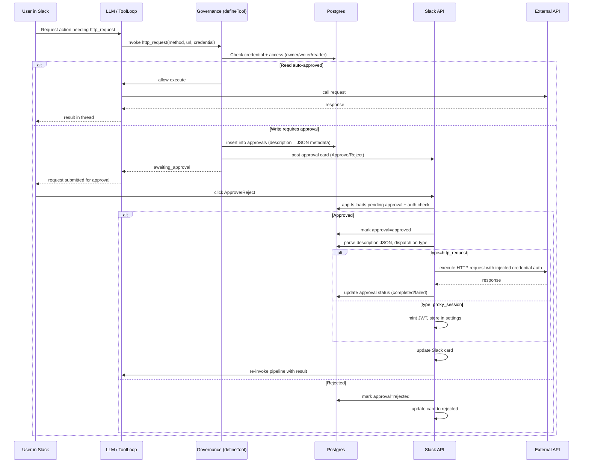

# HITL Implementation (Current)

This document describes the current Human-in-the-Loop (HITL) flow for governed API writes in Nova.

## Scope

HITL currently applies to:

- governed `http_request` tool executions that are classified as write operations and require approval
- sandbox credential proxy session requests (`request_credential_access`) that grant short-lived, scoped proxy tokens

HITL does not use the legacy policy engine anymore. It is credential-centric and enforced in tool execution + Slack approval actions.

## High-Level Architecture

All approvals flow through one unified system:

1. Something creates a row in the `approvals` table with typed JSON metadata in `description`.
2. A Slack card is posted with `approval_approve_*` / `approval_reject_*` buttons.
3. One handler in `app.ts` dispatches on the `type` field in the metadata:
   - `type: "http_request"` — executes the HTTP request inline, updates the card, re-invokes pipeline.
   - `type: "proxy_session"` — mints a scoped JWT, stores it in settings, re-invokes pipeline.

## Sequence Diagram



## Core Files

- `apps/api/src/lib/tool.ts` — governance intercept for `http_request` (creates approval + Slack card).
- `apps/api/src/lib/approval.ts` — access checks, approver resolution, credential lookup.
- `apps/api/src/lib/proxy-token.ts` — scoped proxy token mint/verify (HMAC-SHA256 with `CRON_SECRET`).
- `apps/api/src/app.ts` — unified Slack interaction handlers (`approval_approve_*`, `approval_reject_*`).
- `apps/api/src/routes/proxy.ts` — credential proxy route (`/proxy/:credentialKey/*`).
- `apps/api/src/tools/http-request.ts` — governed external request tool.
- `apps/api/src/tools/approvals.ts` — `request_credential_access` tool (proxy session requests).
- `apps/api/src/lib/sandbox.ts` — per-command proxy env injection (`NOVA_PROXY_URL`, `NOVA_PROXY_TOKEN`).
- `packages/db/src/schema.ts` — `approvals`, `credentials` schema.

## Data Model (Relevant Tables)

### `credentials`

Used for access control and approver resolution:

- `ownerUserId`
- `key`
- `readerUserIds` (read-only access)
- `writerUserIds` (write access + approver set)
- `approvalSlackChannelId` (optional channel override for approval cards)

### `approvals`

Tracks approval lifecycle:

- identity/context: `id`, `title`, `description` (typed JSON metadata), `credentialKey`, `credentialOwner`
- request shape: `urlPattern`, `httpMethod`, `totalItems`
- state: `status` (`pending`, `approved`, `rejected`, `executing`, `completed`, `failed`)
- progress: `completedItems`, `failedItems`
- approver trace: `approvedBy`
- Slack linkage: `slackMessageTs`, `slackChannel`
- thread context: `requestedBy`, `requestedInChannel`, `requestedInThread`

### Approval metadata format (`description` JSON)

**http_request:**
```json
{
  "type": "http_request",
  "method": "POST",
  "url": "https://api.close.com/api/v1/lead/",
  "body": { "name": "Test" },
  "headers": null,
  "credentialKey": "close_fr",
  "credentialOwner": "U12345",
  "reason": "Creating test lead"
}
```

**proxy_session:**
```json
{
  "type": "proxy_session",
  "reason": "Update 400 leads",
  "ttlMinutes": 15,
  "credentialKey": "close_fr"
}
```

## Governance Logic

Implemented in `checkAccess()` (`apps/api/src/lib/approval.ts`):

- Owner:
  - GET/HEAD/OPTIONS -> auto approve
  - write methods -> require approval
- Writer:
  - GET/HEAD/OPTIONS -> auto approve
  - write methods -> require approval
- Reader:
  - GET/HEAD/OPTIONS -> auto approve
  - write methods -> denied
- everyone else -> denied

In `defineTool()` (`apps/api/src/lib/tool.ts`):

- no credential:
  - GET/HEAD/OPTIONS allowed
  - write methods denied
- credential exists:
  - denied -> throw
  - auto_approve -> execute immediately
  - require_approval -> create approval row + Slack card, return `awaiting_approval`

## Approval Creation

Two entry points, same pattern:

**`tool.ts` governance intercept** (for `http_request` writes):
- Validates channel availability before DB insert (prevents orphaned approvals)
- Inserts one row in `approvals` with `description` = JSON metadata containing the full request
- Posts Slack card with approve/reject buttons

**`request_credential_access` tool** (for proxy sessions):
- Same pattern: channel check → insert → Slack card
- Metadata contains `type: "proxy_session"` + TTL + reason

## Slack Action Handling

In `apps/api/src/app.ts` interactions endpoint:

### `approval_approve_<id>`

1. Validate approval exists and is `pending`
2. Authorize actor (`admin` OR credential owner/writer)
3. Atomic CAS: mark `approved` only if still `pending`
4. Parse `description` JSON, dispatch on `type`:
   - **`proxy_session`**: mint JWT via `mintProxyToken()`, store in settings as `proxy_session_token:{userId}`
   - **`http_request`**: resolve credential, SSRF check, inject auth, `fetch()`, audit log, update status
5. Update Slack card to approved/completed/failed state
6. Re-invoke pipeline in the original thread with result text

### `approval_reject_<id>`

1. Same authorization checks
2. Atomic CAS: mark `rejected` only if still `pending`
3. Update Slack card to rejected state

## Credential Proxy Session Flow

For high-volume API operations, Nova can request a scoped proxy session instead of executing many one-off `http_request` calls:

1. LLM calls `request_credential_access(credential_key, reason, ttl_minutes?)`.
2. Tool creates a pending approval and posts Slack card with `approval_approve_*` / `approval_reject_*` buttons.
3. On approval:
   - handler atomically transitions approval `pending -> approved`
   - mints JWT via `mintProxyToken({ sub=requestedBy, creds=[credential_key], owner=credentialOwner, exp })`
   - stores token in settings as `proxy_session_token:{userId}` (user-scoped to prevent collision)
   - re-invokes pipeline in the original thread with a synthetic "access granted" message
4. On next `run_command`, `getSandboxEnvs()` injects:
   - `NOVA_PROXY_URL` (e.g. `https://<prod-host>/proxy`)
   - `NOVA_PROXY_TOKEN`
5. Sandbox script calls:
   - `POST ${NOVA_PROXY_URL}/${credential_key}/${full_target_url}`
6. `/proxy/:credentialKey/*` route (`apps/api/src/routes/proxy.ts`):
   - verifies Bearer JWT + expiry
   - checks requested `credentialKey` is in token scope
   - maps HTTP method to read/write intent for credential access check
   - fetches credential using `credentialOwner` from token (supports shared credentials)
   - applies `injectCredentialAuth()`
   - blocks private/internal targets with `isPrivateUrl()`
   - forwards request and streams response back
   - writes audit entry to `credential_audit_log`

## Security Properties

- Credential plaintext is never returned to LLM directly.
- Access checks are performed server-side against credential owner/writer/reader lists.
- Approval/rejection authorization is re-validated at click time (live credential lookup).
- Proxy tokens are user-scoped (`proxy_session_token:{userId}`) to prevent session collision.
- Proxy tokens contain `credentialOwner` so shared credentials work without leaking ownership to the requester.
- Proxy tokens are scoped to approved credential keys and expire quickly (default 15 minutes).
- Proxy route enforces SSRF protection (`isPrivateUrl`) on every proxied request.
- Every proxied request is audited in `credential_audit_log` with request/response metadata.
- Sensitive values (tokens, secrets) are redacted in `setSetting` logs (both success and error paths).
- Header sanitization is centralized in `sanitizeHeaders()` from `api-credentials.ts`.
- Sandbox env injection is fail-closed: requires `activeUserId` match before injecting proxy token.

## Legacy Notes

- Legacy policy-driven approval system is removed from runtime path.
- Legacy `action_log` HITL table/fields were historical and are not part of current execution flow.
- `approval_items` table exists in schema (migration safety) but is no longer written to or read from.
