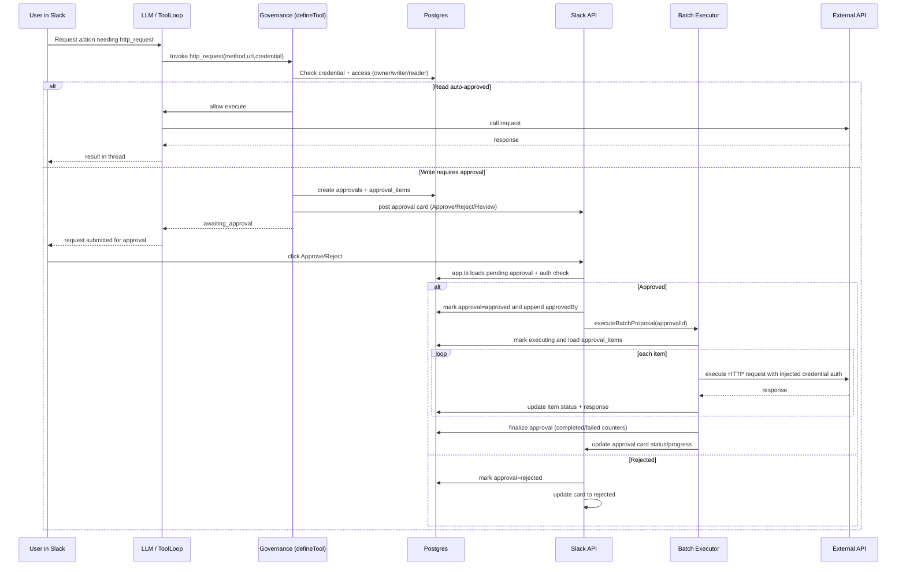
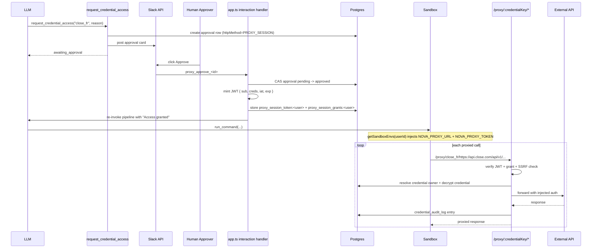

# HITL Implementation (Current)

This document describes the current Human-in-the-Loop (HITL) flows for governed API access in Nova.

## Scope

HITL currently applies to two credential-governed paths:

1. governed `http_request` executions that are classified as write operations and require approval
2. governed sandbox proxy sessions requested via `request_credential_access`, which let sandbox scripts call external APIs through the server-side `/proxy/:credentialKey/*` route without ever receiving raw credentials

HITL does not use the legacy policy engine anymore. It is credential-centric and enforced in tool execution, proxy session issuance, and Slack approval actions.

## High-Level Architecture

### Governed `http_request`

1. LLM calls `http_request`.
2. `defineTool()` governance intercept in `apps/api/src/lib/tool.ts` checks credential access.
3. If write + authorized writer/owner: create approval proposal (`createProposal`).
4. Slack card is posted with Approve/Reject/Review buttons.
5. Approver action (`approval_approve_*`) marks approval approved and executes `executeBatchProposal`.
6. Batch executor performs requests sequentially and updates approval + Slack status.

### Governed sandbox proxy session

1. LLM calls `request_credential_access`.
2. Tool validates the credential + writer/owner access and writes a proxy-session approval row.
3. Slack card is posted with `proxy_approve_*` / `proxy_reject_*` actions.
4. On approval, the handler mints a short-lived JWT signed with `CRON_SECRET`.
5. The JWT is stored in settings and exposed to sandbox commands as `NOVA_PROXY_TOKEN`; the base URL is exposed as `NOVA_PROXY_URL`.
6. Sandbox scripts call `/proxy/:credentialKey/*`; the server validates the JWT, resolves the approved credential, injects auth server-side, forwards the request, and audits the access.

## Sequence Diagram

## Proxy Session Sequence Diagram

## Core Files

- `apps/api/src/lib/tool.ts` - governance interception for `http_request`.
- `apps/api/src/lib/approval.ts` - access checks + approver resolution.
- `apps/api/src/lib/batch-executor.ts` - proposal creation, item execution, Slack card updates.
- `apps/api/src/lib/proxy-token.ts` - HMAC-SHA256 proxy JWT mint/verify helpers + session setting keys.
- `apps/api/src/app.ts` - Slack interaction handlers (`approval_approve_*`, `approval_reject_*`, `approval_review_*`).
- `apps/api/src/tools/http-request.ts` - governed external request tool.
- `apps/api/src/tools/approvals.ts` - explicit `request_credential_access` tool for sandbox proxy sessions.
- `apps/api/src/lib/sandbox.ts` - injects `NOVA_PROXY_URL` and `NOVA_PROXY_TOKEN` into sandbox commands for approved users.
- `packages/db/src/schema.ts` - `approvals`, `approval_items`, `credentials` schema.

## Data Model (Relevant Tables)

### `credentials`

Used for access control and approver resolution:

- `ownerUserId`
- `key`
- `readerUserIds` (read-only access)
- `writerUserIds` (write access + approver set)
- `approvalSlackChannelId` (optional channel override for approval cards)

### `approvals`

Tracks approval lifecycle and execution status:

- identity/context: `id`, `title`, `description`, `credentialKey`, `credentialOwner`
- request shape: `urlPattern`, `httpMethod`, `totalItems`
- state: `status` (`pending`, `approved`, `rejected`, `executing`, `completed`, `failed`)
- progress: `completedItems`, `failedItems`
- approver trace: `approvedBy`
- Slack linkage: `slackMessageTs`, `slackChannel`

For proxy sessions:

- `httpMethod = "PROXY_SESSION"` distinguishes the approval from batch execution approvals
- `urlPattern` stores a small JSON metadata blob with the requested proxy TTL

### `approval_items`

Per-item execution rows:

- request payload: `method`, `url`, `body`, `headers`
- status: `pending`, `executing`, `succeeded`, `failed`, `skipped`
- execution output: `responseStatus`, `responseBody`, `error`, `executedAt`

## Governance Logic

Implemented in `checkAccess()` (`apps/api/src/lib/approval.ts`):

- Owner:
  - GET/HEAD/OPTIONS -> auto approve
  - write methods -> require approval
- Writer:
  - GET/HEAD/OPTIONS -> auto approve
  - write methods -> require approval
- Reader:
  - GET/HEAD/OPTIONS -> auto approve
  - write methods -> denied
- everyone else -> denied

In `defineTool()` (`apps/api/src/lib/tool.ts`):

- no credential:
  - GET/HEAD/OPTIONS allowed
  - write methods denied
- credential exists:
  - denied -> throw
  - auto_approve -> execute immediately
  - require_approval -> create proposal and return `awaiting_approval` result

## Proposal Creation

`createProposal()` in `apps/api/src/lib/batch-executor.ts`:

- writes one row in `approvals`
- writes N rows in `approval_items`
- resolves approvers from credential owner + writers (`getApprovers`)
- chooses approval channel:
  - credential-level `approvalSlackChannelId`, else requesting channel, else default env channel
- posts Slack card with:
  - approve, reject, review buttons
  - metadata containing `approval_id`

## Proxy Session Request Creation

`request_credential_access()` in `apps/api/src/tools/approvals.ts`:

- validates the credential exists
- requires owner/writer access (`checkAccess(..., "POST")`)
- writes a single `approvals` row with `httpMethod = "PROXY_SESSION"`
- posts a dedicated Slack card with:
  - `proxy_approve_<id>`
  - `proxy_reject_<id>`
- returns `{ status: "awaiting_approval", approval_id }`

## Slack Action Handling

In `apps/api/src/app.ts` interactions endpoint:

- `approval_approve_<id>`
  - validate approval exists and is `pending`
  - authorize actor (`admin` OR credential owner/writer)
  - avoid duplicate approvals (`approvedBy` contains user)
  - append user to `approvedBy`
  - mark approval `approved`
  - execute `executeBatchProposal` directly

- `approval_reject_<id>`
  - same authorization checks
  - mark approval `rejected`
  - update Slack card to rejected state

- `approval_review_<id>`
  - open modal with first items for manual inspection

- `proxy_approve_<id>`
  - validate approval exists and is `pending`
  - authorize actor (`admin` OR credential owner/writer)
  - CAS `pending -> approved`
  - mint proxy JWT with credential scope + expiration
  - store per-user proxy session settings
  - update Slack card to approved state
  - re-invoke the pipeline so the sandbox command can continue with proxy env vars

- `proxy_reject_<id>`
  - same authorization checks
  - mark approval `rejected`
  - update the card to rejected state

## Execution Path

Approval execution runs directly from the approve-action handler in `apps/api/src/app.ts`:

- approval is transitioned to `approved`
- `executeBatchProposal({ approvalId })` is invoked immediately
- executor updates statuses (`executing` -> `completed` / `failed`) and Slack card state

## Batch Execution Details

`executeBatchProposal()`:

- load approval, ensure `status === approved`
- mark `executing`
- load `approval_items` in sequence
- load credential value (`getApiCredentialWithType`)
- execute each HTTP item sequentially
- update item status + response payload
- maintain progress counters on `approvals`
- circuit breaker:
  - window: 50 items
  - threshold: >20% failures
  - remaining pending items marked `skipped`
- final status set to `completed` (with failure count in Slack text when needed)

## Auth Injection During Batch Execution

Batch execution now supports current credential format (`authScheme` + `value`):

- `bearer`, `oauth_client`, `google_service_account` -> `Authorization: Bearer ...`
- `basic` -> parse JSON or fallback to raw username, then build `Authorization: Basic ...`
- `header` -> parse `{ key, secret }` and set custom header
- `query` -> parse `{ key, secret }` and append to query string

## Proxy Route Execution

`app.all("/proxy/:credentialKey/*")` in `apps/api/src/app.ts`:

- reads `Authorization: Bearer <proxy-jwt>`
- validates signature + expiry with `verifyProxyToken()`
- checks that `credentialKey` is included in the JWT scope
- resolves the approved grant (`proxy_session_grants:<userId>`) to recover the credential owner
- loads the credential via `getApiCredentialWithType(...)`
- blocks SSRF via `isPrivateUrl()`
- injects auth with `injectCredentialAuth()`
- forwards the original method, headers, and body to the external API
- returns the upstream response directly to the sandbox
- writes an audit entry via `credential_audit_log`

### Sandbox environment injection

`getSandboxEnvs(userId)` in `apps/api/src/lib/sandbox.ts`:

- reads `proxy_session_token:<userId>`
- validates expiry with `verifyProxyToken()`
- injects:
  - `NOVA_PROXY_URL`
  - `NOVA_PROXY_TOKEN`
- clears stale proxy session settings when the token has expired

## Security Properties

- Credential plaintext is never returned to LLM directly.
- Access checks are performed server-side against credential owner/writer/reader lists.
- Approval/rejection authorization is re-validated at click time (live credential lookup).
- Execution endpoint is protected by `CRON_SECRET`.
- Sandbox scripts never receive raw credential values; they only receive a scoped, time-limited proxy JWT.
- Proxy JWTs are limited to approved credential keys and expire automatically.
- Every proxied request is checked for SSRF and written to `credential_audit_log`.

## Legacy Notes

- Legacy policy-driven approval system is removed from runtime path.
- Legacy `action_log` HITL table/fields were historical and are not part of current execution flow.

## Known Constraints

- Approval mode is currently single-step (`any_one` semantics in practice).
- Batch execution is sequential (no parallel execution).
- Slack card item review modal currently shows a capped preview set.
- Proxy sessions are currently keyed by credential name in the sandbox-facing URL, so only one active owner mapping is stored per credential key per user session.

